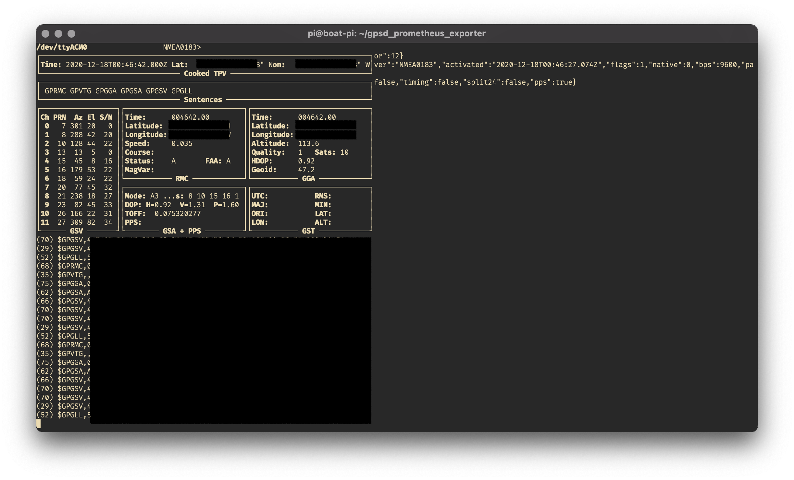

# gpsd_prometheus_exporter
Prometheus Exporter for GPSD

## Prereqs
* python
* pip
* USB GPS device compatible with gpsd
* gpsd installed and running

It's a good idea to make sure that gpsd is working and reporting data. Verify
using gpsmon or similar:



## Usage Instructions

```
gpsd-exporter --help

Usage: gpsd-exporter [OPTIONS]

Options:
  -b, --bind TEXT     Specify alternate bind address [default: 0.0.0.0]
  -p, --port INTEGER  Specify alternate port [default: 8000]
  -d, --debug         Turns on more verbose logging, prints output [default:
                      False]

  --help              Show this message and exit.
```
### Example

Start the exporter on all addresses and port 9999:

```gpsd-exporter -b 0.0.0.0 -p 9999```


### Adding this exporter to Prometheus
```
  - job_name: gps
    static_configs:
    - targets: ['boat-pi:8000']
      labels:
        group: 'gps'
        location: 'Boat'
```